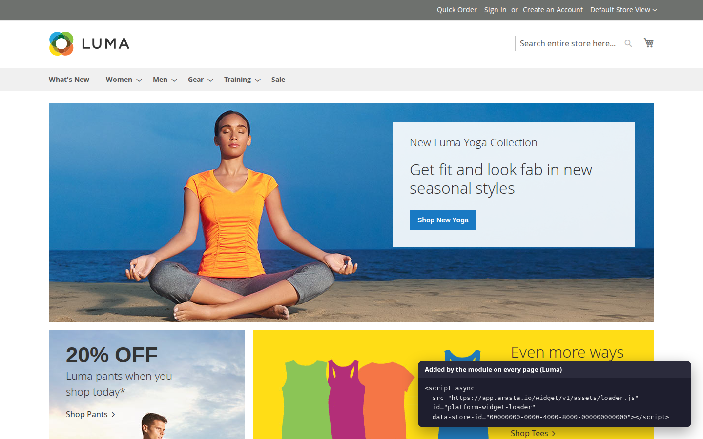

# Softaware Arasta Live Chat for Magento 2

Connects a Magento store to Arasta, SoftAware's live chat and support
platform. The module adds the Arasta chat widget to every storefront page (Luma and Hyvä), tells the widget which
customer is signed in with a short-lived signed token, lets Arasta fetch invoice PDFs, and links orders placed after
a chat to the conversation.

Package `softaware/module-arasta-live-chat`, module `Softaware_ArastaLiveChat`. Free.
Replaces `platform/module-connector` (`Platform_Connector`) 1.x; see [Upgrading from 1.x](#upgrading-from-platformmodule-connector-1x).



## Demo and documentation

- Storefront demo: [Luma](https://demo.softawarecommerce.com/) · [Hyvä](https://demo.softawarecommerce.com/hyva/)
- Admin demo: https://demo.softawarecommerce.com/try-admin/arasta-live-chat
- [User guide](docs/user-guide.md) · [FAQ](docs/faq.md) · [Changelog](CHANGELOG.md)

## Features

- **Widget loader** on every storefront page, including the cart and checkout: the same tag as Arasta's embed code
  (`<script src="…/loader.js" data-store-id="…" async>`), added once, asynchronously. Luma uses a small RequireJS
  component; Hyvä gets its own vanilla JavaScript template (no RequireJS), picked automatically through the
  `hyva_default` layout handle.
- **Signed customer identity**: for signed-in customers the tag gets `data-customer-token`, an HS256 JWT signed with
  the store's Arasta signing secret (claims `sub` = customer ID, `email`, `iat`, `exp`; lifetime 60 to 3600 seconds).
  The token comes from a private customer-data section (`platform-identity`), so it is never part of full-page-cached
  HTML. Expired tokens are replaced in the browser. For guests with a cart the tag gets `data-cart-id` (masked
  quote ID). Every change is announced with the `platform:identity` window event.
- **Order linking**: Arasta can tag the shopper's cart with the conversation ID (`POST /V1/platform/quote/attribute`).
  The ID is copied to the order (`platform_conversation_id` on `quote` and `sales_order`), and when the order is
  placed it is posted to Arasta, signed with `X-Platform-Signature`. Best effort, 3-second timeout; a failure never
  stops the checkout.
- **REST endpoints for the Arasta integration**: the store's own invoice PDF and capability discovery.
- **Admin settings** per store view under Stores > Configuration > Softaware > Arasta Live Chat; the signing secret
  is stored encrypted.
- **Content Security Policy**: `app.arasta.io` is whitelisted (`etc/csp_whitelist.xml`, also `wss://` for
  connections); a different loader host set in the admin is allowed automatically on the storefront.

## Requirements

Magento Open Source or Adobe Commerce 2.4.7 to 2.4.9, PHP 8.2 to 8.5, `softaware/module-core` ^1.0 (installed
automatically). Themes: Luma, Blank and their children; Hyvä 1.3+ (the Hyvä checkout uses the Luma fallback, where the
Luma template is used).

## Installation

```bash
composer config repositories.softaware composer https://repo.softawarecommerce.com
composer config --auth http-basic.repo.softawarecommerce.com PUBLIC_KEY PRIVATE_KEY
composer require softaware/module-arasta-live-chat
bin/magento setup:upgrade
bin/magento setup:di:compile            # production mode only
bin/magento setup:static-content:deploy # production mode only
bin/magento cache:flush
```

## Configuration

Stores > Configuration > Softaware > Arasta Live Chat (ACL `Softaware_ArastaLiveChat::config`). All settings can be
set per website and store view.

| Setting | Path | Default |
| --- | --- | --- |
| Enabled | `softaware_arasta_live_chat/general/enabled` | Yes |
| Widget Loader URL | `softaware_arasta_live_chat/widget/loader_url` | `https://app.arasta.io/widget/v1/assets/loader.js` |
| Store ID | `softaware_arasta_live_chat/widget/store_id` | empty |
| Signing Secret (encrypted, at least 32 characters) | `softaware_arasta_live_chat/identity/signing_secret` | empty |
| Identity Token Lifetime (seconds, 60 to 3600) | `softaware_arasta_live_chat/identity/ttl_seconds` | 3600 |

Copy the Store ID (`data-store-id` of the embed code) and the signing secret from the Arasta dashboard (Stores > your
store > Widget). The widget appears once the Store ID is set. Without a signing secret, customers chat as guests and
orders are not linked. The loader URL must be `https://` (plain `http://` only for `localhost` / `127.0.0.1`).
When **Enabled** is No, nothing is rendered, the identity section is empty, the quote attribute endpoint answers
"No active cart" and no order links are sent; the invoice PDF and version endpoints stay available to the
integration.

The settings can also be kept out of the database, for example
`bin/magento config:set --lock-env softaware_arasta_live_chat/identity/signing_secret '<secret>'` (the signing secret
is marked as sensitive, so `app:config:dump` does not write it to `config.php`).

Remove any Arasta `<script>` tag you added to your theme by hand, or the widget is loaded twice.

## REST endpoints and ACL (for the Arasta integration)

Create an integration for Arasta in System > Extensions > Integrations and, on its **API** tab, tick
**Softaware > Arasta Live Chat > Arasta Live Chat API** (`Softaware_ArastaLiveChat::api`) in addition to the
resources Arasta asks for. Save and **Reauthorize**.

| Method and URL | Access | Request | Response |
| --- | --- | --- | --- |
| `GET /V1/platform/invoices/:invoiceId/pdf` | `Softaware_ArastaLiveChat::api` | none | `{"file_name", "content_type": "application/pdf", "content": "<base64>"}`; 404 for an unknown invoice |
| `GET /V1/platform/version` | `Softaware_ArastaLiveChat::api` | none | `{"module_version", "magento_version", "capabilities": ["invoice_pdf", "signed_identity", "quote_attribute", "order_link"]}` |
| `POST /V1/platform/quote/attribute` | anonymous (shopper's browser) | `{"conversationId": "<UUID>", "cartId": "<masked quote ID, guests only>"}` | `true`; 400 for a non-UUID, 404 without an active cart |

The quote attribute endpoint resolves the cart on the server: a signed-in customer's active cart from the session
(the `cartId` is ignored), a guest cart only through its masked ID, and never a customer's cart through a masked ID.

**Order link** (sent by the store): `POST {loader origin}/public/v1/integrations/magento/orders` with
`Content-Type: application/json`, `X-Platform-Signature: sha256=<hex HMAC-SHA256 of the raw body, keyed with the
signing secret>` and the body
`{"storeId", "orderId" (null at placement time), "incrementId", "grandTotal", "currency", "conversationId"}`.

## Upgrading from platform/module-connector 1.x

2.0.0 is the same connector under the SoftAware name. The external contract with Arasta is unchanged (endpoints,
response shapes, capabilities, token claims and attributes, signature header, `platform_conversation_id` column).

```bash
composer remove platform/module-connector
composer require softaware/module-arasta-live-chat
bin/magento setup:upgrade
```

The two packages cannot be installed together (Composer `conflict`). On `setup:upgrade` a data patch:

- copies settings saved under `platform_connector/*` to `softaware_arasta_live_chat/*` (all scopes;
  `widget/store_key` becomes `widget/store_id`; the secret is stored encrypted). Values that exist only in
  `app/etc/env.php` / `config.php` under the old paths are still read as a fallback; move them to the new paths when
  convenient;
- grants `Softaware_ArastaLiveChat::api` to every integration and admin role that had `Platform_Connector::api`, so
  the Arasta integration keeps working without re-authorising.

Layout block `platform.connector.widget` is now `softaware.arasta.widget`; the PHP namespace is
`Softaware\ArastaLiveChat` (was `Platform\Connector`).

## Privacy

For signed-in customers the browser receives a token with the customer ID and email address, which the widget passes
to Arasta so that agents see who they are talking to. Placed orders that started from a chat are sent to Arasta with
their number, total and currency. Nothing else is sent by the module; what the widget itself collects is covered by
your agreement with Arasta. Mention Arasta as a processor in your privacy notice.

## Development

Unit tests (PHPUnit 10.5) run against the Magento installation the module sits in (or `MAGENTO_ROOT`):

```bash
cd app/code/Softaware/ArastaLiveChat && php phpunit.phar -c phpunit.xml.dist
```

## Licence

Proprietary. © Softaware Commerce.
