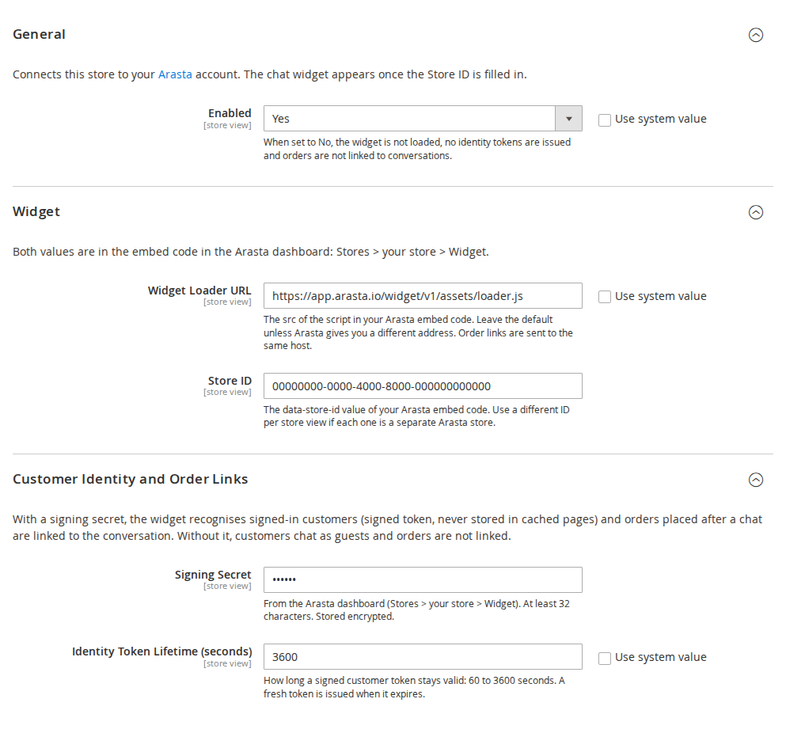
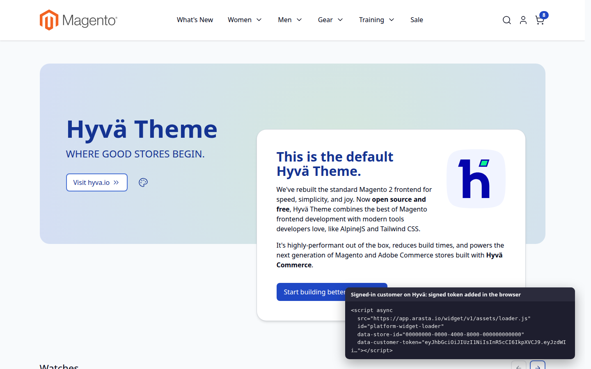
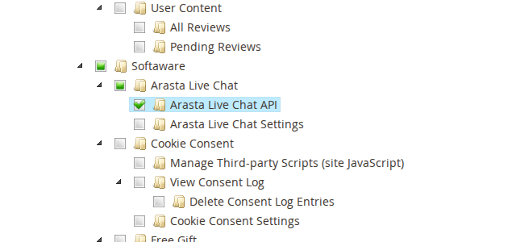

# Arasta Live Chat for Magento 2 — User Guide

Connects your store to [Arasta](https://arasta.softawarecommerce.com/), SoftAware's live chat and support platform:
the chat widget on every storefront page, signed-in customers recognised in the chat, invoice PDFs for your agents,
and orders linked to the conversation that led to them.

- Demo (Luma): https://demo.softawarecommerce.com/
- Demo (Hyvä): https://demo.softawarecommerce.com/hyva/
- Admin demo: https://demo.softawarecommerce.com/try-admin/arasta-live-chat
- Changelog: [CHANGELOG.md](../CHANGELOG.md) · Questions: [FAQ](faq.md)

## 1. Requirements

| | |
| --- | --- |
| Magento | Open Source or Adobe Commerce 2.4.7 – 2.4.9 |
| PHP | 8.2 – 8.5 |
| Themes | Luma, Blank and themes based on them; Hyvä 1.3+ |
| Other | An Arasta account; `softaware/module-core` (installed automatically) |

## 2. Installation

```bash
composer config repositories.softaware composer https://repo.softawarecommerce.com
composer config --auth http-basic.repo.softawarecommerce.com PUBLIC_KEY PRIVATE_KEY
composer require softaware/module-arasta-live-chat
bin/magento setup:upgrade
bin/magento setup:di:compile            # production mode only
bin/magento setup:static-content:deploy # production mode only
bin/magento cache:flush
```

On Hyvä, the module's template is used automatically; no Tailwind build is needed (the module adds no CSS).

If you used the previous package `platform/module-connector`, remove it first (`composer remove
platform/module-connector`). Your settings and the integration's API permission are carried over by
`setup:upgrade`; see the README section "Upgrading from platform/module-connector 1.x".

To update later: `composer update softaware/module-arasta-live-chat`, then the same `bin/magento` commands.

## 3. Quick start

1. In the Arasta dashboard open **Stores > your store > Widget** and copy the embed code. It looks like this:

   ```html
   <script src="https://app.arasta.io/widget/v1/assets/loader.js" data-store-id="YOUR-STORE-ID" async></script>
   ```

2. In Magento go to **Stores > Configuration > Softaware > Arasta Live Chat**.
3. Paste the `data-store-id` value into **Store ID**. Keep the default **Widget Loader URL** unless Arasta gave you a
   different one.
4. To recognise signed-in customers and link orders, paste the **Signing Secret** from the same Arasta page.
5. Save. Flush the full-page cache if your storefront still shows the old pages.
6. Create the Arasta integration (section 6) so that Arasta can fetch invoice PDFs.

Remove any Arasta `<script>` tag you added to your theme or a CMS block by hand; otherwise the widget is loaded twice.



## 4. Settings

All settings can be set for the default scope, a website or a store view. Use different Store IDs per store view
when each one is a separate store in Arasta.

**General**

- **Enabled** — Yes by default. When No, the widget is not loaded, no identity tokens are issued, carts are not
  tagged and orders are not linked. The invoice PDF and version endpoints stay available to the integration.

**Widget**

- **Widget Loader URL** — the `src` of the embed code. Default `https://app.arasta.io/widget/v1/assets/loader.js`.
  Must start with `https://`. Order links are sent to the same host.
- **Store ID** — the `data-store-id` of the embed code. The widget is only added when this is filled in.

**Customer Identity and Order Links**

- **Signing Secret** — from the Arasta dashboard, at least 32 characters, stored encrypted. Without it customers chat
  as guests and orders are not linked.
- **Identity Token Lifetime (seconds)** — 60 to 3600, default 3600. A new token is fetched in the background before
  the current one expires.

You can also set any of these with `bin/magento config:set` (add `--lock-env` to keep a value in `app/etc/env.php`),
for example `bin/magento config:set --lock-env softaware_arasta_live_chat/identity/signing_secret '<secret>'`.

## 5. What happens on the storefront

On every page, including the cart and checkout, the module adds the loader exactly as in the embed code:

```html
<script src="https://app.arasta.io/widget/v1/assets/loader.js" id="platform-widget-loader"
        data-store-id="YOUR-STORE-ID" async></script>
```

- **Signed-in customers** (with a signing secret): the tag also gets `data-customer-token`, a signed token with the
  customer ID and email address, valid for the configured lifetime. Arasta checks the signature, so the chat shows
  the right customer and nobody can pretend to be someone else.
- **Guests with a cart**: the tag gets `data-cart-id` (the cart's masked ID). When a chat starts, the widget sends the
  conversation ID to the store, which stores it on the cart.
- The token and cart ID are loaded in the browser after the page (Magento customer data on Luma, private content on
  Hyvä). Full-page-cached HTML never contains them, so caching stays fully effective.



**Order links.** When an order is placed from a cart that carries a conversation ID, the order number, total,
currency and conversation ID are posted to Arasta, signed with the signing secret. Agents then see the order in the
conversation. The request has a 3-second timeout and never blocks the checkout; failures are logged
(`var/log/system.log`, "Arasta Live Chat: order link …"). The conversation ID is also stored on the order
(`sales_order.platform_conversation_id`).

## 6. The Arasta integration (REST API)

Arasta reads invoice PDFs and checks which features your store supports through Magento's REST API.

1. **System > Extensions > Integrations > Add New Integration** (or edit the one you already use for Arasta).
2. On the **API** tab choose **Custom** and tick the resources Arasta asks for plus
   **Softaware > Arasta Live Chat > Arasta Live Chat API**.
3. Save, **Activate** (or **Reauthorize**) and enter the tokens in Arasta.



| Endpoint | Purpose |
| --- | --- |
| `GET /rest/V1/platform/invoices/{invoiceId}/pdf` | The invoice PDF from your store's own template (base64) |
| `GET /rest/V1/platform/version` | Module version, Magento version and the supported features |
| `POST /rest/V1/platform/quote/attribute` | Called by the widget in the shopper's browser to tag the cart |

The first two need the integration permission above. The third is public by design: it only accepts a conversation
ID in UUID format, and finds the cart from the signed-in customer's session or the guest's masked cart ID; a masked
ID never gives access to a customer's cart.

## 7. Content Security Policy

`app.arasta.io` is whitelisted for scripts, connections (including WebSocket), images, styles, fonts and frames, so
the widget also loads on pages where Magento enforces CSP (checkout). If you set a different loader host, the module
allows that host on the storefront automatically.

## 8. Permissions

Under **System > Permissions > User Roles > Role Resources**:

- **Softaware > Arasta Live Chat > Arasta Live Chat Settings** — the configuration section.
- **Softaware > Arasta Live Chat > Arasta Live Chat API** — the REST endpoints (meant for the Arasta integration).

## 9. Privacy

The module passes the signed-in customer's ID and email address to the Arasta widget, and sends the order number,
total, currency and conversation ID of orders placed after a chat to Arasta. What the widget itself collects is
covered by your agreement with Arasta. List Arasta as a processor in your privacy notice and, if you use a cookie
banner, classify the chat widget according to your Arasta setup.

## 10. Troubleshooting

- **No widget on the storefront** — check that the module is enabled for the store view and the Store ID is set,
  then flush the full-page cache. View the page source and search for `platform-widget-loader`.
- **Widget appears twice** — remove the hand-made Arasta `<script>` from your theme, CMS blocks or tag manager.
- **Customers are not recognised** — set the Signing Secret (same value as in Arasta) and sign in again.
- **Orders are not linked** — the Signing Secret must be set; check `var/log/system.log` for "Arasta Live Chat: order
  link" messages; the server must be able to reach the loader host over HTTPS.
- **REST answers "The consumer isn't authorized"** — tick **Arasta Live Chat API** in the integration and
  reauthorise it.
- **Saving the settings fails** — the Signing Secret must be at least 32 characters and the Loader URL must start
  with `https://`.
